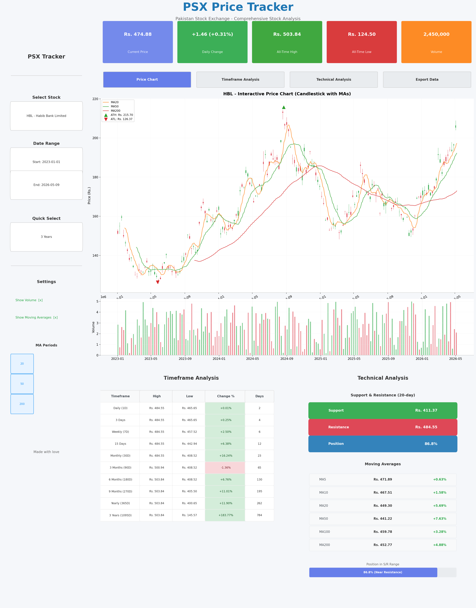

# PSX Price Tracker - Streamlit GUI

A beautiful, interactive web application for tracking Pakistan Stock Exchange (PSX) stocks built with **Streamlit** and **Plotly**.



## Features

### Interactive Dashboard
- **Sidebar Controls**: Stock selection, date range picker, quick presets, settings
- **Real-time Metrics Cards**: Current Price, Daily Change, All-Time High/Low, Volume
- **Tabbed Interface**: 4 organized tabs for different analysis views

### Tab 1: Price Chart
- Interactive **candlestick chart** with Plotly
- **Moving Averages** overlay (configurable periods)
- **Volume** chart below price
- **ATH/ATL markers** on chart
- Hover tooltips for detailed data

### Tab 2: Timeframe Analysis
- Complete table with all 11 timeframes
- Color-coded **Change %** (green for positive, red for negative)
- **High/Low comparison** bar chart
- **Period returns** visualization

### Tab 3: Technical Analysis
- **Support & Resistance** levels (20-day)
- **Position indicator** with progress bar
- All **Moving Averages** with price distance
- **Volume analysis** with MA

### Tab 4: Export Data
- Download **JSON** report
- Download **CSV** raw data
- Data preview table

## Installation

```bash
# Install dependencies
pip install streamlit plotly pandas numpy psx-data-reader

# Optional (for Excel export)
pip install openpyxl
```

## Running the App

```bash
# Navigate to the app directory
cd psx-tracker

# Run the Streamlit app
streamlit run psx_tracker_app.py
```

The app will open in your browser at `http://localhost:8501`

## Data Sources

### Option 1: Live PSX Data (Recommended)
The app automatically uses `psx-data-reader` to fetch live data from PSX website:
- GitHub: https://github.com/MuhammadAmir5670/psx-data-reader
- PyPI: https://pypi.org/project/psx-data-reader/

### Option 2: Manual CSV Import
You can also load data from CSV files downloaded from PSX website.

## Supported Stocks

Popular PSX stocks pre-configured:
- **HBL** - Habib Bank Limited
- **OGDC** - Oil & Gas Development
- **ENGRO** - Engro Corporation
- **LUCK** - Lucky Cement
- **MCB** - MCB Bank Limited
- **PPL** - Pakistan Petroleum Limited
- **UNITY** - Unity Foods
- **TRG** - TRG Pakistan

Plus custom symbol input for any PSX stock.

## Timeframes Tracked

| Timeframe | Days |
|-----------|------|
| Daily | 1 |
| 3 Days | 3 |
| Weekly | 7 |
| 15 Days | 15 |
| Monthly | 30 |
| 3 Months | 90 |
| 6 Months | 180 |
| 9 Months | 270 |
| Yearly | 365 |
| 3 Years | 1095 |
| All-Time | All |

## Customization

### Settings in Sidebar
- **Show Volume**: Toggle volume chart
- **Show Moving Averages**: Toggle MA lines
- **MA Periods**: Select which MAs to display (5, 10, 20, 50, 100, 200)

### Date Ranges
- Custom date picker
- Quick presets: 1M, 3M, 6M, 1Y, 3Y, 5Y, All Time

## File Structure

```
psx-tracker/
├── psx_tracker_app.py          # Main Streamlit app
├── psx_tracker_final.py          # Backend library
├── README.md                     # This file
└── requirements.txt              # Dependencies
```

## Requirements

```
streamlit>=1.28.0
plotly>=5.15.0
pandas>=1.5.0
numpy>=1.24.0
psx-data-reader>=1.0.0
openpyxl>=3.1.0  # Optional, for Excel export
```

## Screenshots

### Price Chart Tab
Interactive candlestick chart with moving averages and volume.

### Timeframe Analysis Tab
Complete breakdown of all timeframes with visual charts.

### Technical Analysis Tab
Support/resistance levels and moving averages analysis.

### Export Data Tab
Download reports in JSON and CSV formats.

## Troubleshooting

### psx-data-reader not working?
The app will automatically fall back to sample data. To use live data:
```bash
pip install psx-data-reader
```

### Port already in use?
```bash
streamlit run psx_tracker_app.py --server.port 8502
```

### Data not loading?
- Check your internet connection
- Verify the stock symbol is correct
- Try a different date range

## License

MIT License - Free for personal and commercial use.

## Credits

- Built with [Streamlit](https://streamlit.io/)
- Charts powered by [Plotly](https://plotly.com/)
- Data from [PSX](https://www.psx.com.pk/) via [psx-data-reader](https://github.com/MuhammadAmir5670/psx-data-reader)
